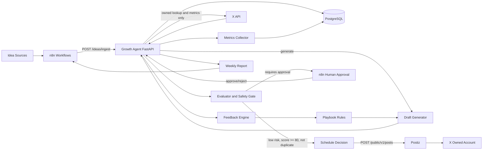

# Architecture

The Growth Agent service coordinates the marketing learning loop while delegating publishing to Postiz and workflow/human approval to n8n.

## Service Boundaries

- Growth Agent stores ideas, drafts, posts, metrics, experiments, playbook rules, and feedback runs.
- Postiz handles publishing and scheduling to X.
- n8n handles orchestration, human approvals, timers, and notifications.
- X API is read-only in this MVP and used only for owned post reconciliation and metrics collection.

## Data Flow

1. n8n ingests ideas from selected sources.
2. Growth Agent generates deterministic MVP drafts from the idea plus active playbook rules.
3. The evaluator scores risk, tags URL-bearing drafts, and checks duplicate or near-duplicate content.
4. Safe low-risk drafts can be scheduled; medium/high-risk drafts require human approval.
5. Scheduled posts are tracked locally with Postiz IDs, then reconciled with X IDs.
6. Metrics snapshots feed the feedback engine.
7. Feedback updates playbook rule weights and informs later draft generation.
