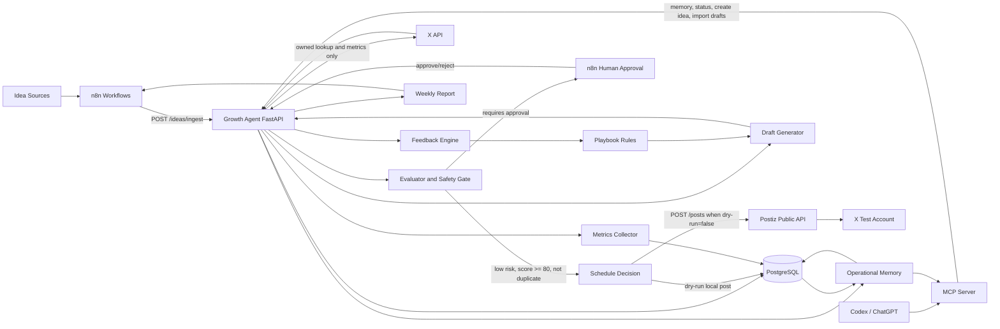

# Architecture

The Growth Agent service coordinates the marketing learning loop while delegating publishing to Postiz and workflow/human approval to n8n.

## Service Boundaries

- Growth Agent stores ideas, drafts, posts, metrics, hypotheses, draft import runs, decision logs, experiments, playbook rules, and feedback runs.
- Postiz handles publishing and scheduling to the configured test X account.
- n8n handles orchestration, human approvals, timers, and notifications.
- Codex / ChatGPT can generate hypotheses and draft candidates through the MCP server, but Growth Agent still owns evaluation, approval state, scheduling gates, and history.
- Codex / ChatGPT conversation history is not the source of truth; Growth Agent DB stores the official operational memory.
- X API is read-only in this MVP and used only for owned post reconciliation and public metrics collection.
- `GET /health` is public. Other endpoints require `GROWTH_AGENT_API_KEY` unless `TESTING=true`; non-health GET endpoints can be made public only with `SAFE_PUBLIC_READS=true`.

## Configuration Flow

`growth_agent.config.Settings` loads from environment variables and `.env`. `scripts/check_config.py` can create `.env` from `.env.example`, generate `GROWTH_AGENT_API_KEY`, and fill safe non-secret defaults.

Postiz variables are treated as user-provided:

- `POSTIZ_BASE_URL`
- `POSTIZ_API_KEY`
- `POSTIZ_X_INTEGRATION_ID`
- `TEST_X_ACCOUNT_HANDLE`

`POSTIZ_BASE_URL` is the complete Public API base URL, for example `https://api.postiz.com/public/v1`. The app appends only `/posts`.

## Data Flow

1. n8n, Codex / ChatGPT through MCP, or an operator ingests ideas through `POST /ideas/ingest`.
2. Growth Agent can generate deterministic MVP drafts, or Codex / ChatGPT can import generated candidates, hypotheses, and context snapshots through `POST /drafts/import`.
3. The evaluator scores risk, tags URL-bearing drafts, and checks duplicate or near-duplicate content.
4. Safe low-risk drafts can be scheduled; medium/high-risk drafts and MCP candidates marked for human review require approval.
5. In dry-run, scheduling creates a local post record with `dry_run=true`.
6. In live test mode, scheduling creates a local in-progress record before calling Postiz, then stores the Postiz post ID.
7. Scheduled posts can be reconciled with owned X IDs manually, or automatically by comparing normalized text similarity plus scheduled/created time proximity against recent owned X posts.
8. Metrics snapshots store public metrics from X only: impressions, likes, replies, reposts, quotes, and bookmarks. Missing X credentials cause metrics collection to skip safely and do not affect startup, dry-run, or Postiz scheduling.
9. `decision_logs` record deterministic decisions across draft import, evaluate, schedule, reconcile, and metrics collection.
10. Feedback updates playbook rule weights and informs later deterministic or Codex / ChatGPT generation.
11. Codex / ChatGPT uses `GET /memory/context` through MCP to read compact history for the next cycle.

## Operational Memory

Operational memory is stored in PostgreSQL and exposed through safe read APIs:

- `hypotheses`: proposed/tested hypotheses, target metrics, confidence, evidence, and metadata.
- `draft_import_runs`: context snapshot, prompt version, imported draft IDs, and generated output from Codex/MCP import operations.
- `decision_logs`: machine-readable decisions for `draft_import`, `evaluate`, `approval`, `schedule`, `reconcile`, and `metrics`.
- `GET /memory/context`: compact bundle of metrics summary, playbook rules, recent hypotheses, recent import runs, recent decisions, and recent automation runs.

This keeps long-term learning in the application database rather than relying on a single Codex or ChatGPT window.

Private metrics, URL clicks, profile clicks, organic metrics, promoted metrics, and non-public metrics are future extensions that require an appropriate user-context authentication boundary.
